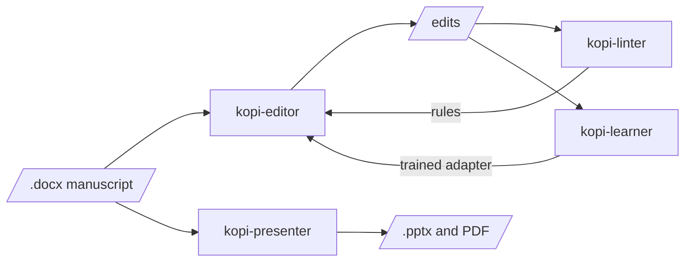

# kopi-workers 

Copy-editing and presentation tools for academic prose. kopi-editor edits a manuscript, kopi-linter
measures how much of that editing rules alone can do, kopi-learner trains the served editor on
better edits, and kopi-presenter turns a paper into a slide deck. kopi-console is one local web
page over the editor and presenter: drop a file, run a command, watch the log. Only the
paragraphs sent for editing leave the machine, and those can go to a private endpoint.

## How they connect



## Getting started

1. Install Python 3.10 or newer from [python.org](https://www.python.org/downloads/). On Windows,
   tick **Add python.exe to PATH** on the installer's first screen.
2. Open PowerShell (a terminal on macOS or Linux) and run:

```powershell
pip install kopi-workers
kopi-console
```

The console opens in the browser at `http://127.0.0.1:5191`. Its pages take the API key and the
documents each tool works on. Each tool also runs on its own as a command of the same name,
`kopi-editor` for example, which opens its menu. `pip install --upgrade kopi-workers` updates
every tool.
