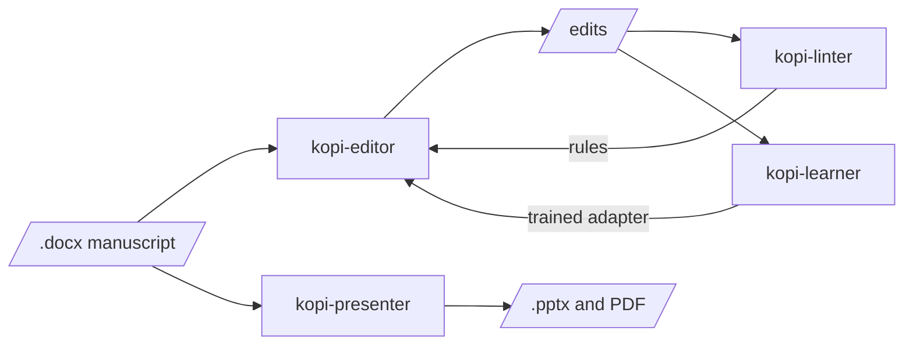

# kopi-workers 

Copy-editing and presentation tools for academic prose. kopi-editor edits a manuscript, kopi-linter
measures how much of that editing rules alone can do, kopi-learner trains the served editor on
better edits, and kopi-presenter turns a paper into a slide deck. kopi-console is one local web
page over the editor, linter and presenter: drop a file, run a command, watch the log. Only the
paragraphs sent for editing leave the machine, and those can go to a private endpoint.

## How they connect



## Setup

Each tool installs from its own folder:

```powershell
cd workers/kopi-editor
pip install -r requirements.txt
python manage.py install
```

## Commands

| Action | Command |
|---|---|
| Open a tool's menu | `cd workers/<tool>; python manage.py` |
