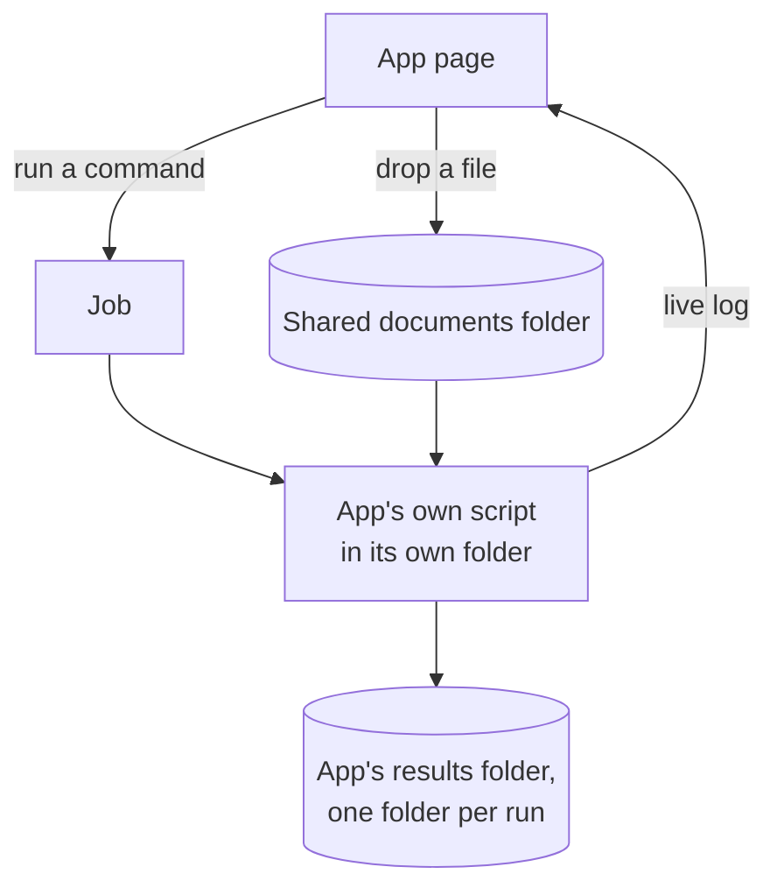

# kopi-console

One local web page for the kopi apps: kopi-editor and kopi-presenter. Each app has its
own page where you drop a file, fill in a command's form, and watch it run. The console runs each
app through its own script in its own folder, keeps keys and model choices in one store outside the
workspace, and answers only on this machine.

## How it works



Each app page has:

| Part | What it does |
|---|---|
| Drop area | Drop files anywhere on the page, or click to choose them; they are copied into the shared `documents/` folder, which every app reads |
| Commands | One form per command, with its live log, a Stop button, and a box for answering a question the app asks |
| Files | The newest files in `documents/` and the app's results, each a link to open or download, and a button to open the folder; **Copy to documents** on any result another app reads |

The **Models** page chooses where each app's model runs: Claude, another service, this computer,
or your own cloud. The **Keys** page holds the keys, and each app's page holds its other settings.
An app left on its own settings reads its `env.yaml` or `config.local.yaml`.

## Layout

```
kopi-console/
├── manage.py      entry point: opens the web page, or runs one command
├── registry.py    the apps, their commands and form fields, the files each takes
├── settings.py    host, port, upload limit, log interval
├── cli/           styled terminal output and the install check
└── web/           Flask app, routes, jobs, file handling, templates and styles
```

## Setup

The console sits beside the kopi apps in `kopi-workers/workers/` and runs them with the same Python, so
install each app's requirements into it first.

```powershell
pip install -r requirements.txt
python manage.py install
```

## Commands

`python manage.py` with no arguments opens the web page at `http://127.0.0.1:5191/`.

| Action | Command |
|---|---|
| Open the web page | `python manage.py` |
| List the apps and their commands | `python manage.py status` |
| Run one command and print its log | `python manage.py run kopi-editor analyze "file=chapter.docx"` |
| Check dependencies and find the apps | `python manage.py install` |

## Cost

The editor's `edit` command and the presenter's `slides` command can call a paid model, so the
page asks before running them. What they spend depends on the model chosen on the Models page;
each app prints its estimate when it finishes. Estimates only.
