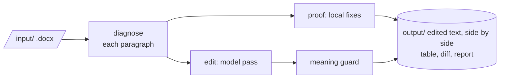

# kopi-editor

Copy-edits an academic `.docx` into plainer prose while keeping the argument, voice, citations and
quotations intact. Diagnosis runs locally; only the paragraphs sent for editing leave the machine,
to Claude, another hosted service, a model on this computer, or a private Cloud Run GPU service of
your own.

## How it works

The document is parsed once and each paragraph is diagnosed for what it needs: fewer words, no
redundant sentences, active voice, shorter sentences. `proof` applies only safe local fixes; `edit`
sends each paragraph to the model with those notes. A guard rejects any edit that changes the
meaning, a citation, or a number, and quotations are never touched.



The number given to `edit` is the words to remove. A small number tightens wording; a large one
also drops redundant sentences.

## Setup

```powershell
pip install -r requirements.txt
python manage.py install
python manage.py settings
```

`settings` picks the backend and model. Put the `.docx` into `input/`.

## Commands

| Action | Command |
|---|---|
| Diagnose a document, no edits | `python manage.py analyze <file.docx>` |
| Apply safe local fixes | `python manage.py proof <file.docx>` |
| Edit with the model | `python manage.py edit <file.docx> [words_to_remove]` |
| Choose backend, model and language | `python manage.py settings` |
| Show the configuration | `python manage.py config` |
| Build the GPU service | `python manage.py deploy` |
| Finish deploying the GPU service | `python manage.py deploy-status --wait` |
| Update dependencies | `python manage.py update` |
| Check dependencies | `python manage.py install` |
