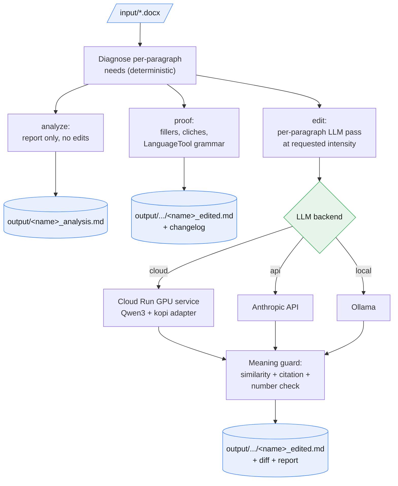

# kopi-editor

Academic prose written for a specialist readership is often harder to read than it needs to be, and a human copyeditor who can preserve an author's argument, voice, citations, and quotations is expensive to hire for every draft. kopi-editor exists to close that gap on a single machine: it parses a `.docx` once, works out deterministically what each paragraph needs (unnecessary words, redundant sentences, passive voice, long sentences), and either applies safe local fixes or hands a language model exactly the paragraphs that need editing with targeted instructions, so a cheaper-than-Opus model can still edit well. How hard it cuts scales with the reduction asked for: ask for nothing and it edits only for clarity, ask for a large cut and it concedes whole redundant sentences. Diagnosis and proofing always run locally; only the paragraphs sent to `edit` ever leave the machine, over a private Cloud Run GPU service, the Anthropic API, or a local Ollama instance.

## LLM backends (for the `edit` route)

Diagnosis and proofing are always local; this choice only affects the `edit` route. There is no default model, it is chosen in `settings`, so the cost of a run is always deliberate.

| Backend (`LLM`) | Where the model runs | Cost reported as |
|---|---|---|
| `cloud` | A private Cloud Run GPU service (Qwen3-32B on an RTX PRO 6000) | estimated $ from GPU runtime |
| `api` | Anthropic API (Haiku / Sonnet / Opus), no GPU, no cold start | $ from token usage |
| `local` | Ollama on the local machine | self-hosted, no cost reported |
| `skip` | no LLM edit | none |

## Data flow



## Layout

```
manage.py               entrypoint (no args opens the menu)
env.yaml.example        config template; copy to env.yaml (gitignored)
deploy.ps1 / deploy.sh  legacy L4/Ollama service (synchronous; deploy --ollama)
requirements.txt
cli/                    command modules: analyze, proof, edit, cloud, api, deploy, settings
kopi/                   diagnose (shared core), proof, llm, step_* helpers, signals, output
cloud/                  serve_vllm.py, the vLLM/Qwen3 GPU service (serve.py is the legacy Ollama one)
input/                  source .docx files (gitignored, kept with .gitkeep)
output/                 generated .md files (gitignored)
docs/ data/ tests/      reference docs, bundled datasets, pytest suite
```

## Setup

Requires Python 3.10 or later.

```
pip install -r requirements.txt
python -m spacy download en_core_web_sm
python manage.py install      # creates env.yaml, checks dependencies
python manage.py settings     # choose LLM backend + model (+ language)
python manage.py              # launch the interactive menu
```

`install` is idempotent and safe to re-run. For the `cloud` backend, `deploy` stages the adapter and fires the image build asynchronously (the terminal frees once the upload finishes); run `deploy-status --wait` to finish it, it deploys the Cloud Run service and writes `BASE_URL` and `JOB_TOKEN` into `env.yaml`. For the `api` backend, paste an Anthropic key in `settings` instead.

First-run downloads: sentence-transformers (`all-MiniLM-L6-v2`, about 40 MB, for the meaning guard) and, for `proof`, LanguageTool (about 200 MB Java engine, then offline).

## Commands

Running `python manage.py` with no arguments opens the interactive menu; every action is also a direct subcommand.

| Action | Command |
|---|---|
| Diagnose a document (report only, no edits) | `manage.py analyze <file.docx>` |
| Conservative deterministic edit, no LLM | `manage.py proof <file.docx> [--lang {british\|american}]` |
| Full plain-language edit via the LLM backend | `manage.py edit <file.docx> [words_to_remove] [--llm {cloud\|api\|local\|skip}] [--lang ...]` |
| Choose LLM backend / model / language | `manage.py settings` |
| Show effective configuration | `manage.py config` |
| Fire the vLLM/Qwen3 image build (async) | `manage.py deploy [--ollama]` |
| Finish and deploy a pending build | `manage.py deploy-status [--wait]` |
| Dev smoke test against the GPU service | `manage.py cloud-test [n] [--source <file>]` |
| Upgrade dependencies and the spaCy model | `manage.py update` |
| Create env.yaml and folders, check dependencies | `manage.py install` |

`<file.docx>` accepts a bare name, which resolves against `input/`. Each of Analyze, Proof, and Full edit, when launched from the menu, lists the `.docx` files found in `input/` to pick from.

## Editing intensity

For `edit`, `words_to_remove` sets the editing intensity, not just a figure in the report. The ratio of words asked for against document length picks a band:

| `words_to_remove` | Band | What the editor does | Max cut per paragraph |
|---|---|---|---|
| omitted or `0` | clarity | plain words, active voice; keeps every sentence; length barely moves | about 6% |
| small (up to about 5% of the text) | light | cuts fillers, tightens wording; keeps every sentence | about 18% |
| moderate (about 5-12%) | firm | tightens wordy passages markedly (15-30%); may merge a weak follow-on | about 35% |
| large (over about 12%) | aggressive | compresses hard and may drop redundant or marginal sentences | about 55% |

Because it is a ratio, the same number means more on a short paper than a long thesis. If one pass falls short of the request, the wordiest remaining paragraphs are re-edited once more to approach the target. The guard never lets a paragraph cut past its band's ceiling, so a clarity pass cannot quietly gut a manuscript, and claims, citations, and numbers are always preserved.

```
python manage.py analyze "chapter 1.docx"          # report only
python manage.py proof   "chapter 1.docx"          # deterministic edit, no LLM
python manage.py edit    "chapter 1.docx"          # full plain-language edit (backend from settings)
python manage.py edit    "chapter 1.docx" 1000      # aggressively, aiming to shed about 1000 words
```

## How it works

All three routes share one deterministic diagnosis (`kopi/diagnose.py`): it parses the document once and produces document-level estimates (unnecessary words, redundant sentences, readability) plus, per paragraph, a small set of categorical editing instructions (always plain language, plus wordiness, redundancy, passive voice, or long sentences when detected).

- `analyze` writes `output/<name>_analysis.md`: readability gauges, the editable levers, key terms (TF-IDF), and a paragraph-by-paragraph worksheet, every paragraph with its scores and the exact edit guidance, for editing by hand.
- `proof` applies only the safe, mechanical fixes, filler and padding removal, cliche and long-to-short word substitution, and LanguageTool grammar, and writes the edited text. It never removes sentences or restructures syntax.
- `edit` sends every eligible paragraph to the LLM backend with its instructions as editor's notes, at the intensity set by the reduction request (`kopi/intensity.py`): the requested band picks the prompt stance (how hard to cut, whether sentences may go) and a per-paragraph length target, and a meaning guard runs on the client, a cosine-similarity check (0.85 or higher) rejects drift, the band's compression ceiling rejects an over-deep cut, and every citation `(Author, Year)` and number is verified preserved. On a recoverable rejection the paragraph is re-prompted once with a softer or corrective note rather than silently kept; if the whole document still falls short of the requested reduction, one top-up pass re-edits the wordiest remaining paragraphs.

Each `edit`/`proof` run writes its bundle into its own `output/<name> <YYYY-MM-DD HHMMSS>/` folder, so repeated runs and multiple documents never overwrite or interleave. The bundle: `<name>_edited.md` (clean text), `<name>.diff` (a standard unified diff for any diff viewer), `<name>_review.md` (repeated proofing suggestions), and a single report, `<name>_report.md` after `edit` (before/after gauges across the same measures, whether the original's key terms still surface, the models used, and the paragraph-referenced change log all in one file) or `<name>_changelog.md` after `proof` (the change log alone).

Quoted text (straight or curly quotes, and indented block quotations) is never edited by any route.

## The GPU service (`cloud` backend)

`manage.py deploy` builds a container serving Qwen3-32B-FP8 plus the `kopi` LoRA adapter (a small set of trained weight deltas layered on the base model) under vLLM behind a small Flask proxy (`cloud/serve_vllm.py`), and deploys it as a Cloud Run service that writes its `BASE_URL` and `JOB_TOKEN` into `env.yaml`. The build is fire-and-retire: `deploy` submits the long image build to Cloud Build asynchronously and returns; `deploy-status --wait` polls it and runs the short service deploy once the image is ready (the `JOB_TOKEN` never leaves the local machine, it is set at deploy time, not baked into the build). Pending-build state lives in `.kopi/`.

- GPU with a warm model: a few seconds per paragraph once the instance is up (Qwen3-32B on a Blackwell RTX PRO 6000).
- Scale-to-zero (`--min-instances 0`): no compute cost when idle; the first request of a session loads the model (a cold start), then every following paragraph is fast.
- Registry storage is separate and accrues whether or not the service is used: the image bakes the FP8 base model, so it lands at roughly 38 GB, billed per GB-month.
- Paragraphs are sent in parallel (4 at a time) over HTTPS, guarded by the `JOB_TOKEN`; the meaning guard runs locally. Only paragraphs sent for editing ever leave the machine.

> GPU required: the service uses an NVIDIA RTX PRO 6000 (Blackwell). Confirm the target region (default `europe-west4`) has availability and quota.

A legacy L4/Ollama service (`qwen2.5:7b`) is still available via `manage.py deploy --ollama`.

### Retiring the service between spells of use

If editing happens in bursts weeks apart, storing the image costs more than rebuilding it. Retire both, and let the next `deploy` recreate them:

```
gcloud run services delete kopi-editor-vllm --region europe-west4
gcloud artifacts repositories delete kopi --location europe-west4
```

> Delete the repository, not individual images: artifact-level delete can be blocked by org policy even for an owner, while repository delete and cleanup policies still work. The first rebuild afterwards has no cached layers to pull, so allow for a full model bake rather than a code-only rebuild.

## Cost reporting

Both LLM backends report the cost of a run.

| Backend | How cost is derived |
|---|---|
| `api` | actual token usage priced by model (Haiku $1/$5, Sonnet $3/$15, Opus $5/$25 per 1M in/out); the shared system prompt is cached, cutting input cost on multi-paragraph runs |
| `cloud` | an estimate from active GPU service time (GPU + vCPU + memory, per-second list price); the deployed instance shape is read from `env.yaml` (default Blackwell RTX PRO 6000 / 20 vCPU / 80 GiB) |

> Estimates only, verify current Anthropic and Cloud Run GPU pricing before relying on them.

## Dependencies and academic precedents

| Package | Purpose |
|---|---|
| spaCy + en_core_web_sm | parse, sentence features, quotation detection |
| sentence-transformers | redundancy detection; LLM meaning guard |
| language-tool-python | British/American English proofing (`proof`) |
| textstat | Flesch readability (document + paragraph) |
| anthropic / ollama | LLM plain-language editing (`edit`) |

The redundancy test uses IDF-weighted overlap and marginal-novelty (MMR) selection, both drawn from the information-retrieval literature.
