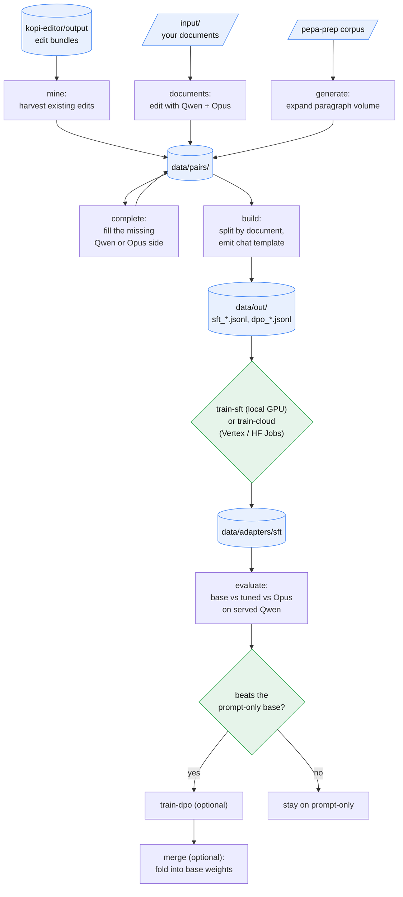

# kopi-learner

The served Qwen3 model behind `kopi-editor` is cheap to run but occasionally makes the wrong editorial call, cutting too little when nothing was asked for or too much when it was. kopi-learner exists to close that gap without paying for Opus on every paragraph: it distils Opus's academic copy-edits into a LoRA adapter (a small set of trained weight deltas layered on the served base model) for that same Qwen3 editor. Its primary source is the edit bundles that already sit in `kopi-editor/output`, the Opus and Qwen runs from ordinary use, which it mines into supervised and preference datasets in the editor's exact chat template, optionally expanding from a wider multi-author corpus. The goal is narrow: a cheap served model that makes Opus-like editorial decisions, better restraint when no cut is asked, cleaner concision when one is, not a general capability upgrade. The whole loop is self-hosted and Opus is only a labeller; there is no local GPU here, so every adapter is trained and evaluated against the served endpoint, never a locally loaded base model, and credentials are reused from `kopi-editor`'s `env.yaml` rather than held separately.

Fine-tuning here is a gated, deliberate step, not a reflex. Why this task clears the learning policy gate is recorded in [WHY_TUNE.md](WHY_TUNE.md).

## Reality check

| | What it is | What it is not |
|---|---|---|
| Output | A LoRA adapter making Qwen3 edit more like Opus on this prose distribution | Opus-level comprehension of novel, hard arguments |
| Teacher | Opus as a per-paragraph labeller (its edits are the gold) | A hosted fine-tuning service (training stays self-hosted) |
| Justification | Must beat the prompt-only base on a held-out test (`evaluate`) | "Looks better", the eval is mandatory |

## Data flow



## Layout

```
manage.py               entrypoint (no args opens the menu)
config.yaml             sampling, band mix, split, QLoRA hyperparameters
editor.py               the one bridge to kopi-editor (prompt, diagnosis, guard, bands, creds)
input/                  drop .docx/.md/.txt here for the documents route
corpus/                 bundles.py (mine edits), documents.py, sample.py, paragraphs.py
teachers/               opus.py (gold "chosen", online + Batch API), qwen.py (served "rejected")
distil/                 pairs.py, complete.py, batch.py, dataset.py
train/                  setup.py (QLoRA base/merge), sft.py, dpo.py
cloud/                  vertex.py, hf.py (the two cloud backends), train_entry.py (runs on the box)
eval/                   baseline.py (base vs tuned vs Opus on held-out test), failures.py
cli/                    argparse dispatch, menu, config, install
data/                   pairs/, out/, adapters/ (all gitignored)
requirements.txt        data-generation dependencies
requirements-train.txt  heavy GPU training stack (training box only)
```

## Setup

Requires Python 3.11 or later. kopi-learner reuses `kopi-editor`'s runtime (its distillation source) and its `env.yaml`.

```
pip install -r requirements.txt
pip install -r ../kopi-editor/requirements.txt
python -m spacy download en_core_web_sm
python manage.py install            # checks the editor link, credentials, and bundles
```

There are no secrets of its own: the Anthropic key and the served-Qwen `BASE_URL`/`JOB_TOKEN` are read from `kopi-editor`'s `env.yaml`, whatever its `deploy`/`settings` already wrote there, so set them once in `kopi-editor`. For a local GPU train, also install `requirements-train.txt`; for cloud training the laptop needs only `requirements.txt` (the cloud SDKs are already in it), run `python manage.py cloud-setup`, which checks credentials and configures the target without any file editing.

## Commands

Running `python manage.py` with no arguments opens the interactive menu; every action is also a direct subcommand. The pipeline runs, in order: `mine` or `documents`, then optionally `complete` and `collect`, then `build`, then `train-sft` or `train-cloud` plus `pull-adapter`, then `evaluate`, then optionally `train-dpo`, then optionally `merge`.

| Action | Command |
|---|---|
| Harvest existing kopi-editor edit bundles (primary source) | `manage.py mine` |
| Run your own `input/` documents through Qwen + Opus | `manage.py documents [--batch]` |
| Fill the missing model side of a mined pair (for DPO) | `manage.py complete [--fill {qwen\|opus\|both}] [--limit N] [--batch]` |
| Expand volume from the pepa-prep corpus | `manage.py generate [--papers N] [--max-paragraphs N] [--seed N] [--batch]` |
| Collect finished Opus Batch API jobs into samples | `manage.py collect [--batch <id>] [--wait]` |
| Assemble the train/val/test SFT + DPO datasets | `manage.py build` |
| QLoRA supervised fine-tune on a local GPU | `manage.py train-sft` |
| Configure a cloud training backend (Vertex or HF Jobs) | `manage.py cloud-setup [--backend vertex\|hf ...]` |
| Submit the QLoRA SFT to the configured cloud backend | `manage.py train-cloud` |
| Check or wait on a submitted training job | `manage.py train-status [--run <id>] [--wait]` |
| Download a trained adapter locally | `manage.py pull-adapter [--run <id>]` |
| Held-out A/B: base vs tuned vs Opus gold, on the served Qwen | `manage.py evaluate [--adapter kopi] [--rescore]` |
| Bucket the last eval's guard rejections by reason | `manage.py eval-failures` |
| Run the held-out A/B on a CPU Vertex job instead | `manage.py evaluate-cloud [--adapter kopi]` |
| Check or wait on a submitted eval job | `manage.py eval-status [--run <id>] [--wait]` |
| Download a finished eval and score the verdict locally | `manage.py pull-eval [--run <id>]` |
| Preference-align after SFT (gated, optional) | `manage.py train-dpo` |
| Fold an adapter into the base weights for vLLM serving | `manage.py merge [--adapter sft]` |
| Check the editor link, credentials, and corpus | `manage.py install` |

`--batch` sends the Opus (gold) side through the Anthropic Batch API, about 50% cheaper and asynchronous; the served Qwen side always runs online, and the Opus job is collected later with `collect` (resumable: the batch id and units are persisted, so an interrupted run never re-spends). Most batches finish in minutes, with a 24-hour maximum.

## How it works

1. `mine`, the primary route, walks `kopi-editor/output`, reads each bundle's `_original.md` and `_edited.md` (which align paragraph by paragraph), detects the editing model from `_report.md` or the `arch/<model>/` folder, and reconstructs each paragraph's production prompt by re-diagnosing the original at the band implied by the run's realised reduction. Opus edits become gold, Qwen edits become the served side. No API or GPU cost, it is existing edits. Samples land in `data/pairs/`.
2. `documents` runs files dropped into `input/` (`.docx`/`.md`/`.txt`, ingested exactly like `kopi-editor`) through both the served Qwen and Opus, sampling clarity, firm, and aggressive bands. This is the folder-driven way to add gold from new manuscripts, and to populate the held-out eval with documents distinct from the training set.
3. `complete`, optional and used for DPO, fills the missing model side: for paragraphs edited only with Opus it runs the served Qwen, and vice versa, so the same paragraph has both sides.
4. `generate`, optional, expands volume from the `pepa-prep` corpus across authors.
5. `collect` gathers finished Opus Batch API jobs into samples, run after any `--batch` step.
6. `build` deduplicates, splits by document (so no paragraph leaks across splits), and emits the served chat template: `sft_*.jsonl` (`messages` ending in Opus's edit) and `dpo_*.jsonl` (`prompt` plus `chosen` = Opus and `rejected` = Qwen, only where both edited the same original). The held-out `test.jsonl` is never trained on.
7. `train-sft` fits a QLoRA adapter (a 4-bit frozen base) toward Opus's edits, the first and usually only tuning step. It runs on a local GPU box; `train-cloud` does the same fit on a cloud GPU when there is no local one (see Cloud training below).
8. `evaluate` is the gate: on the held-out test it edits each paragraph twice on the served Qwen vLLM endpoint, once base (prompt-only) and once through the baked `kopi` LoRA module (the tune), scoring both against Opus's gold on meaning-closeness, word-delta to Opus (the direct read on over- or under-cutting), and guard pass rate. There is no local GPU inference here; the adapter is measured exactly as served, and the tune is justified only if it beats the base. The adapter must already be deployed to the editor service (`kopi-editor`'s deploy scripts stage the pulled adapter and serve it as `kopi`). `evaluate-cloud` runs the identical loop on a CPU Vertex job instead, fire-and-forget like `train-cloud`, since inference is the served Qwen and scoring (spaCy plus embeddings) runs locally on `pull-eval`.
9. `train-dpo` is optional and gated: only after SFT is well-formed but still occasionally picks the weaker edit.
10. `merge` folds an adapter into the base weights for a single vLLM-served model. Optional and usually skipped, serving the adapter directly keeps it portable.

## Cloud training

For when there is no local GPU, which is the default here. Two selectable backends share the same submit, watch, pull flow and the same run history in `data/adapters/cloud_runs.json`; `cloud.backend` (set by `cloud-setup`) decides which one a new `train-cloud` uses. Vertex AI is the default; Hugging Face Jobs is the no-quota-wait alternative.

```
python manage.py cloud-setup     # one-time: pick backend + its target; checks credentials
python manage.py build           # assemble the datasets
python manage.py train-cloud     # submit to the configured backend (async, returns immediately)
python manage.py train-status --wait     # poll until the job finishes
python manage.py pull-adapter    # download the adapter to data/adapters/sft
```

> Vertex backend: request GPU quota before the first run. Vertex custom-training GPU quota starts at 0 on every new project, so `train-cloud` is rejected until it is raised. In the quotas console (service: Vertex AI API) find "Custom model training Nvidia A100 80GB GPUs" for the target region and request 1; single-GPU requests are typically approved within minutes to about two business days. `cloud-setup` enables the required APIs but cannot grant quota, that approval belongs to Google. The `hf` backend below has no quota queue.

- `cloud-setup` opens a wizard that verifies application-default credentials (offering to run the login command), then enumerates GCP projects and buckets, with an option to create one, and lists the A100 regions and GPU shapes. Picks are saved to the gitignored `config.local.yaml`; nothing needs hand-editing. Scriptable too, with flags plus `--no-input`.
- `train-cloud` submits the QLoRA SFT as a Vertex custom-training job on a single A100 and returns at once; the job runs in the cloud and billing stops automatically when it ends. The run's job name, region, and bucket are recorded, so `train-status` and `pull-adapter` work in a later session with no arguments (they default to the last run).
- The base model is `Qwen/Qwen3-32B` (full precision; AWQ is the serving format only, a QLoRA tune cannot be built on an already-AWQ checkpoint). It is pulled fresh onto the training box, never stored locally.
- What moves: `train-cloud` tars the training code and uploads it plus the `data/out/*.jsonl` datasets to a bucket; the job pip-installs the train stack onto Vertex's prebuilt PyTorch container, fits the adapter, and writes it back to the same run prefix on GCS.
- The adapter is the portable artefact, a few hundred MB of `adapter_model.safetensors` plus config. `pull-adapter` brings it to `data/adapters/sft`; it also stays in GCS. Nothing 32B-sized ever touches the laptop.
- Serving without merging: point vLLM at the AWQ base with `--enable-lora --lora-modules kopi=<adapter-dir>`. The adapter stays a separate, swappable file that can be re-loaded on any future service, which is why `merge` is skipped by default.

> The adapter is bound to `Qwen/Qwen3-32B`. It is portable across time (re-serve it later) but not across base models, if the served base changes, retrain.

### Hugging Face Jobs backend

Switch with `python manage.py cloud-setup --backend hf`. Same submit, watch, pull commands; the difference is who runs the GPU job. Use this when waiting on a Vertex quota grant is not an option.

- No quota queue. HF Jobs runs on pre-paid credits, top up on the Hugging Face billing page and the chosen GPU runs immediately.
- The GPU flavor defaults to `a100-large` (one A100 80 GB), the highest dependable flavor for a 4-bit QLoRA tune. `h200` (faster, pricier) and `l4x1` (needs offload) are also selectable; `rtx-pro-6000` needs a bitsandbytes build that supports its architecture.
- It runs the same script as Vertex, not a hosted tune service: the job pulls a CUDA PyTorch image, installs the train stack, and runs `cloud/train_entry.py`.
- What moves: `train-cloud` stages the code plus `data/out/*.jsonl` to a private per-run HF dataset repo; the job trains and pushes the adapter to a private per-run HF model repo, which `pull-adapter` downloads. Data and the adapter live in the HF account's private repos, and the adapter stays gitignored locally.
- Base model, portability, and the no-merge vLLM serving story are identical to the Vertex backend.

## Cost / caveats

- `mine` is free (local). `complete` and `generate` are billed by Opus tokens plus served-Qwen GPU time; a LoRA needs only a few thousand clean pairs, so start with `mine` alone and add `complete` for the DPO gaps before reaching for `generate`. A whole-corpus `generate` run is well over $1000 and unnecessary; it is capped at `sample.max_paragraphs` by default.
- Local training needs a GPU that fits a 4-bit 32B QLoRA tune (an RTX PRO 6000 96 GB comfortably; an L4 24 GB only with offload). The optional `merge` loads the base at bf16, size the box for that.
- Cloud training bills per GPU-hour while the job runs and stops when it ends; a 32B QLoRA SFT on a few thousand pairs is a short job, roughly 1 to 4 hours on one A100. On Vertex that is a few A100-hours; on HF Jobs the `a100-large` flavor is about $2.50/hr, so a run is typically the low tens of dollars, plus the pip-install at job start on either backend.
- Cloud eval runs on a CPU Vertex box (no GPU), so it bills only cheap CPU minutes while the loop runs; the served-Qwen inference it drives bills the usual GPU time on the editor service, including its scale-from-zero cold start on the first call. Running `evaluate` locally is cheaper if already at the machine; the cloud route just frees the terminal.

> Estimates only, verify current Anthropic, Vertex AI, and Hugging Face Jobs pricing before relying on them.

The tune lifts editorial judgement on this distribution; it does not make Qwen3 comprehend a hard novel argument as well as Opus. Genuinely subtle documents should still route to Opus.
