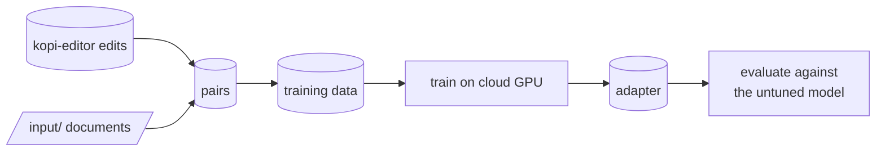

# kopi-learner

Trains the Qwen3 model behind kopi-editor to make Opus-like editing decisions: holding back when no
cut is asked for, and cutting cleanly when one is. Opus's edits are the examples; the result is a
small LoRA adapter (trained weight changes layered on the served model). Training and evaluation
run on cloud GPUs, never on this machine.

## How it works

Edits that kopi-editor has already produced are paired up, Opus's version as the target and
Qwen's as the weaker one. The pairs become training data, a cloud GPU job fits the adapter, and an
evaluation on held-out paragraphs checks that the tuned model beats the untuned one before it is
used.



## Setup

```powershell
pip install -r requirements.txt
pip install -r ../kopi-editor/requirements.txt
python -m spacy download en_core_web_sm
python manage.py install
python manage.py cloud-setup
```

Keys and the editor service address are read from kopi-editor's `env.yaml`.

## Commands

Run in this order: collect pairs, build, train, pull, evaluate.

| Action | Command |
|---|---|
| Collect pairs from kopi-editor's edits | `python manage.py mine` |
| Collect pairs from documents in `input/` | `python manage.py documents` |
| Fill in the missing side of a pair | `python manage.py complete` |
| Add pairs from the pepa-prep corpus | `python manage.py generate` |
| Collect finished batch jobs | `python manage.py collect` |
| Build the training data | `python manage.py build` |
| Train on a local GPU | `python manage.py train-sft` |
| Choose the cloud training service | `python manage.py cloud-setup` |
| Train in the cloud | `python manage.py train-cloud` |
| Check a training job | `python manage.py train-status` |
| Download the adapter | `python manage.py pull-adapter` |
| Evaluate tuned against untuned | `python manage.py evaluate` |
| Evaluate in the cloud | `python manage.py evaluate-cloud` |
| Check an evaluation job | `python manage.py eval-status` |
| Download and score an evaluation | `python manage.py pull-eval` |
| Group rejected edits by reason | `python manage.py eval-failures` |
| Preference training after the first tune | `python manage.py train-dpo` |
| Fold the adapter into the base model | `python manage.py merge` |
| Check setup | `python manage.py install` |
