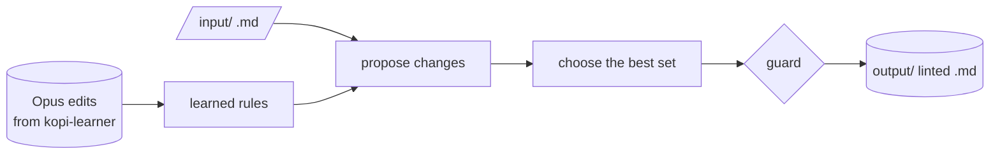

# kopi-linter

Measures how much plain-language editing of academic prose can be done by rules alone, with no
model call, and does that much. The target is Opus's own edits: every rule is learned from them and
scored against them. Nothing leaves the machine.

## How it works

Each Opus edit is aligned with its original and every change is classified by type. Rules learned
from those edits propose changes to a document, the best non-overlapping set is chosen for the
requested intensity, and a guard keeps any paragraph whose citations or numbers would change.



Progress is one number, closure: the share of the distance from the original to Opus's edit that
the linter closes.

## Setup

kopi-editor and kopi-learner sit beside this folder.

```powershell
pip install -r requirements.txt
pip install https://github.com/explosion/spacy-models/releases/download/en_core_web_sm-3.7.1/en_core_web_sm-3.7.1-py3-none-any.whl
python -c "import nltk; nltk.download('wordnet')"
python manage.py install
```

## Commands

| Action | Command |
|---|---|
| Lint a document | `python manage.py lint <file.md>` |
| Score the linter against Opus | `python manage.py evaluate` |
| Classify every Opus edit | `python manage.py evidence` |
| Rebuild rule tables from Opus's edits | `python manage.py induce` |
| Check whether Opus makes a given change at all | `python manage.py probe <generator>` |
| Check whether a local backend can write a change | `python manage.py execute` |
| Fit the keep-or-delete model | `python manage.py tag` |
| Build the sheet for judging damage by hand | `python manage.py damage` |
| Compare every method for one rule family | `python manage.py experiment <family>` |
| Compare ways to rank phrases for dropping | `python manage.py rank` |
| Compare ways to split a reduction across paragraphs | `python manage.py allocate` |
| Check whether dropped sentences can be predicted | `python manage.py sentence` |
| Compare an encoder against the plain features | `python manage.py encoder` |
| Check dependencies | `python manage.py install` |
