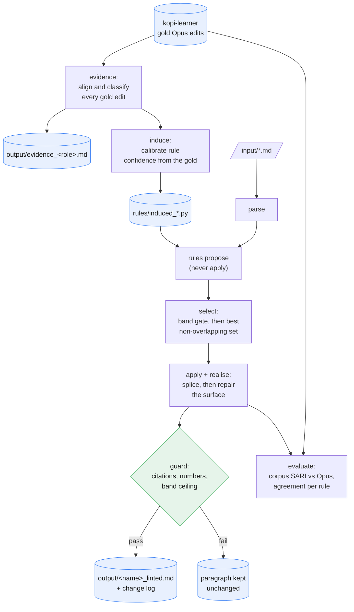

# kopi-linter

Plain-language copy-editing of academic prose currently needs a language model, which means
a GPU service or an API bill for every draft, and kopi-editor's deterministic route only
reaches the safe mechanical fixes: fixed filler phrases, cliché swaps, grammar. kopi-linter
exists to find out how far the rest can be taken deterministically, on one machine, with
nothing leaving it. Its wager is that the editorial judgement in question is not
unreachable, only undocumented: kopi-learner already holds 1,490 paragraphs edited by Opus
across four intensity bands, so what a good editor does to academic prose is a measurable
object rather than a matter of opinion. The repo starts from that measurement. The evidence
layer aligns every gold edit with its original, classifies each difference by its
linguistic type, and reports what a rule set would actually have to do; the transformation
layers are then built and justified against that report, not against intuition.

Everything that decides *what to change* runs on the machine in front of you, with no
network call and no API key, because a linter that never sends a paragraph to a stranger is
the point rather than a feature. One optional backend writes replacement wording with a
small model, and it can speak either to a model server you have deployed yourself or to one
running on localhost. Nothing here talks to a third party.

## Status

Early, and deliberately measured rather than advertised. The evidence layer, the linting
engine and the experiment harness all run. Two transformation families are live: relative-clause
reduction, and a fitted keep-or-delete decision that scores every word and proposes the ones the
gold editor would cut. A third (`adjunct`) has three competing licence models under comparison
and none of them is registered. The execution tier is probed but not built: `manage.py execute`
has measured what a backend could write at a known site, and nothing yet writes one during a
lint, so every edit the linter makes is still a deletion.

Progress is tracked as a single per cent, **closure**, defined in
[docs/good.md](docs/good.md) section 0 and standing at 1.0%, the same on documents the fitted
model has never seen as on the ones it was fitted on. The work follows a fixed loop,
analyse then plan then build then evaluate then analyse again, set out in
[docs/method.md](docs/method.md). Six documents carry the state:

| Document | Question it answers |
|---|---|
| [docs/plan.md](docs/plan.md) | the roadmap: one numbered chain, what each step is worth, and how it fails |
| [docs/typology.md](docs/typology.md) | what a plain-language linter has to do, measured from 1,490 gold edits |
| [docs/approaches.md](docs/approaches.md) | which techniques might do it |
| [docs/constraints.md](docs/constraints.md) | what building it revealed, and what each limit blocks |
| [docs/good.md](docs/good.md) | what a correct edit is, and how anything is scored |
| [docs/method.md](docs/method.md) | how an increment is allowed to proceed |

## Data flow



## Layout

```
manage.py               entrypoint (no args opens the menu)
requirements.txt
evidence/               load, align, taxonomy, induce, adjuncts: the measurement layer
lint/                   edit, registry, select, bands, guard, run: the engine
rules/                  one module per transformation family, plus induced tables
grammar/                orthography (British/American), realise (surface repair)
eval/                   sari, harness, grammatical: the gate every rule has to pass
execute/                template, ceiling, decoder: backends that write a replacement span
tagging/                vocabulary, features, fit, model, weights: keep-or-delete per word
experiments/            registry, cases, compare, report: method-versus-method comparison
cli/                    argparse dispatch, menu, install, ui, progress
docs/                   typology, approaches, constraints, good, method
input/ output/ data/    working folders (gitignored)
```

## Setup

Requires Python 3.10 or later, and a sibling checkout of `kopi-editor` and `kopi-learner`
for the rule tables and the edit corpus.

```
pip install -r requirements.txt
python -m spacy download en_core_web_sm
python -c "import nltk; nltk.download('wordnet')"
python manage.py install      # checks packages, models, and the corpus link
python manage.py              # launch the interactive menu
```

`install` is idempotent and safe to re-run. It provisions nothing and asks for nothing; it
only reports what is missing and the command that fixes it.

## Commands

Running `python manage.py` with no arguments opens the interactive menu; every action is
also a direct subcommand.

| Action | Command |
|---|---|
| Lint a document and write the edited text | `manage.py lint <file.md> [--band {clarity\|light\|firm\|aggressive}]` |
| Ask whether Opus performs a transformation at all | `manage.py probe <generator> [-n N]` |
| Ask whether a local backend can write the transformation | `manage.py execute [--backend NAME] [--family F] [-n N] [--transport {served\|local}] [--reproduce]` |
| Fit the keep-or-delete decision the linter uses | `manage.py tag [-n N]` |
| Compare every method for one family | `manage.py experiment <family> [-n N] [--split {all\|train\|test}]` |
| Compare scoring functions for which phrase to drop first | `manage.py rank [-n N] [--split {all\|train\|test}]` |
| Score the linter against Opus on the gold corpus | `manage.py evaluate [-n N] [--show]` |
| Mine the gold edit corpus into a transformation report | `manage.py evidence [--role {opus\|qwen\|all}] [-n N]` |
| Rebuild rule tables from the gold corpus | `manage.py induce [--family {support-verb\|adjunct}] [--minimum N]` |
| Check dependencies, models, and the corpus link | `manage.py install` |

**`probe` comes first, before anything is built.** Point any candidate generator at the gold
corpus and it reports what Opus did there: `attested`, `declined`, or `rewritten or
dropped`. Only the first two are decidable and only their ratio means anything. This exists
because linguistic validity turned out not to predict attestation at all: reducing `which
revolve around time` to `revolving around time` is textbook whiz-deletion described in every
grammar of English, and Opus declines it 169 times to 1. Building it would have added 647
instances of reach at an accuracy that *subtracts* closure, while looking like the project's
biggest advance in any coverage-based measure.

`execute` asks the other half of the question. It hands a backend one span Opus changed,
four words of context each side, and the name of the change made there, and asks for the
replacement. The site is a gift and the wording is not, which separates *can a local
executor perform this transformation* from *can it decide where*. `keep` and `delete` are
carried as anchors in every table, so a backend that has learned nothing shows up as zero
rather than as a plausible number. `--reproduce` runs two passes over the same spans and
checks they produce the same bytes, with a sampling decoder as the control that has to fail.

`tag` fits the model the `tagged` rule reads and writes it to `tagging/weights.py` as plain
numbers, so the engine scores a word with a dot product and never imports scikit-learn. Rerun
it after the corpus changes; the rule uses whatever is committed until you do.

`experiment` is the one to reach for once a family survives the probe: it runs every
registered method for a family against the same licence cases and the same corpus, and
writes a comparison. A method with no alternative to be compared against has been measured,
not evaluated.

`--role opus` measures the gold standard, `--role qwen` measures the cheap served model on
the same paragraphs, and the difference between the two reports is the editorial judgement
the linter has to supply. `-n` truncates the run for a quick pass; a full pass over the
1,490 gold edits takes about two and a half minutes.

## The split

Every fifth document by name is held out: 20 documents and 1,257 paragraphs to train on, 5
documents and 233 to test on. The split is by **document** and never by paragraph, because
paragraphs from one document share an author, a topic and a vocabulary, so splitting inside
a document puts near-copies of the training data into the test set.

`induce` and `probe` read the train split only, so a decision fitted to the corpus never
spends the held-out documents. `evaluate` runs over everything and reports both sides.
`experiment` and `rank` default to `all` and take `--split test` for a score no induced table
has seen, because at present the held-out side carries too few edits to separate two methods.

## How the evidence layer works

A copy-edit is monotone: sentences are tightened, absorbed, split and dropped, but almost
never reordered. That makes the sentence alignment used for parallel corpora (Gale and
Church, 1993) directly applicable, with the beads relabelled for editing rather than
translation. `evidence/align.py` runs a dynamic program over the monotone grid to recover
the cheapest sequence of 1-1 rewrites, 1-n splits, n-1 merges and 1-0 deletions, scoring
candidate beads by IDF-weighted content-lemma containment, the same measure kopi-editor's
redundancy scan uses. Inside each bead, a token-level diff yields the minimal edit script.

One correction matters enough to record. A monotone aligner cannot tell "two sentences
became one" from "one sentence was cut and its neighbour kept", since both are n-to-1
beads, and left alone it reports every drop as a merge. `_split_out_deletions` promotes a
source sentence to its own deletion when its content lemmas fail to survive into the
target, which on a 400-edit probe reclassified 23% of merge-bead sources.

`evidence/taxonomy.py` then classifies each span through an ordered cascade of structural
detectors: dependency relations, WordNet derivational morphology, word frequency, and a
concreteness test for dead metaphor. The order matters, so that "participants were given an
alias" becoming "we gave each participant an alias" is recorded as one voice change rather
than three unrelated word swaps.

Coverage against kopi-editor's 165 production rules is computed alongside, which is how the
project knows what it is adding rather than repeating.

## How the engine works

Six stages, and the order is the design: **parse, propose, select, apply, realise, guard.**

Rules only ever *propose*. They read the parse and return spans they would change, with a
confidence and the taxonomy family they belong to; nothing is applied until every proposal
has been seen. That is what makes the output independent of the order rules were
registered in, which is the difference between a linter that is deterministic and one that
merely looks it.

Selection is the interesting stage, because proposals conflict: two rules will claim the
same words. Choosing the best set of non-overlapping spans is weighted interval scheduling,
which has an exact dynamic program rather than needing a greedy heuristic, so `lint/select.py`
sorts by end offset and finds each proposal's predecessor by binary search. The word budget
is applied afterwards, dropping the weakest edits until the band's floor is respected.

Bands are per-family confidence thresholds over one rule set, not four rule sets, because
that is what the evidence says intensity is: every band draws on the same families in
different proportions. A band raises the bar rather than closing a door.

`grammar/realise.py` then repairs the surface: articles, doubled spaces and commas,
capitalisation. It is deliberately unaware of which rule fired, so it can fix damage from a
combination of edits no single rule anticipated, but it is **scoped to the joins the edits
created**. A paragraph nothing fired on comes back byte-identical. That scoping is not a
detail: repairing whole paragraphs made the pass responsible for every sentence in the
corpus rather than for the joins it made, and both of its observed corruptions happened in
paragraphs where no rule had fired at all.

Finally the guard checks the invariants (citations, numbers, the band ceiling) and, on
failure, returns the paragraph untouched. A failed lint is always a no-op, never a partial
edit. The guard is necessary and far from sufficient: it passed a sentence that had lost its
main predicate. Detecting that automatically is harder than it sounds, because a parser asked
to analyse broken text produces a well-formed tree anyway, relabelling whatever it has to. The
detectors that survive read the part-of-speech tags rather than the dependencies, which is the
correction [docs/constraints.md](docs/constraints.md) C17 makes to C4.

## Results

One number tracks progress: **closure**, the per cent of the word-level distance from the
original text to Opus's edit that has been closed. Doing nothing scores 0, reproducing
Opus scores 100%, and an edit Opus did not make scores below 0. Over all 1,490 gold
paragraphs, against Opus's edit of the same paragraph at the same band:

| System | closure | reach | accuracy |
|---|---:|---:|---:|
| do nothing | 0.0% | 0.0% | n/a |
| **kopi-linter** | **1.0%** | 2.3% | 72.1% |
| served Qwen3-32B | -9.5% | 135.9% | 46.5% |

`reach` is how much of Opus's work was attempted, `accuracy` how much of that landed, and
`closure = reach x (2 x accuracy - 1)` exactly. At 50% accuracy closure is zero however much
is attempted. The linter's licence mechanism works and is applied to a small fraction of the
text; reach is still the whole problem. See [docs/plan.md](docs/plan.md) for what each family
is worth.

Split out, the held-out documents read **1.0% closure at 71.4% accuracy** against the train
split's 1.0% and 72.3%. The keep-or-delete model is fitted on the train documents only, so
that near-identical pair is the point of the row rather than an aside: it scores the same on
prose it has never seen. Earlier versions of this table could not say anything of the kind,
because the held-out side rested on fourteen edits (`docs/constraints.md` C14).

> Closure measures agreement with Opus, not quality. Qwen at -9.5% has not written worse
> English, it has written different English, and it is quoted here as a reference point
> rather than a verdict. Reconstructing Opus is this project's objective, not Qwen's.

### How the linter decides what to cut

`manage.py tag` reads the corpus as a tagging problem: every source word gets one tag, keep it
or delete it, plus an optional phrase to write before it. That scheme covers 205,800 words with
nothing unalignable, and **26.3% of source words are deletions**, so the decision is a 74/26
classification with 174,231 training examples rather than the rare event it was taken for.

A logistic regression over 17 parse and frequency features, fitted on the train documents and
scored on held-out ones, gives a probability per word. The band threshold reads it directly, so
the intensity dial and the model's operating point are the same number:

| Threshold | Words fired on | Precision | Projected closure |
|---:|---:|---:|---:|
| 0.50 | 2,716 | 55.4% | 3.9% |
| **0.60** | **1,118** | **64.9%** | **4.5%** |
| 0.70 | 446 | 74.9% | 3.0% |
| 0.80 | 165 | 87.3% | 1.7% |

Guessing delete for every word scores 25.2%. Ablating the feature groups says the signal is
lexical first and syntactic second: length features alone never reach the threshold on a single
word in 31,464, so the model is largely a learned deletion lexicon.

Five shape priors sit in front of the model, because a per-token score cannot know that the
word it likes is its sentence's only verb, or the object of a verb that is staying. They cost a
quarter of the closure and remove nineteen of the twenty-one introduced grammatical defects,
which is why the highest-scoring variant is not the one that ships. A prior holds one word back
rather than refusing the phrase around it, so the rest of a run is still deleted. Each is registered as an ablation, so `manage.py experiment tagged`
prints the trade rather than asserting it.

### What a local backend could write

`manage.py execute` scores the same metric at span level, over the 13,316 spans where Opus
rewrote rather than deleted. Deleting the span outright is the anchor, because deletion is
the only move the engine can currently make:

| Backend | Rewriting closure | Rewriting exact |
|---|---:|---:|
| delete the span (anchor) | 28.8% | 0.0% |
| plain code | 0.2% | 0.5% |
| a 970-phrase induced vocabulary, perfect tag choice | 52.6% | 64.6% |

The third row reads the gold and is a ceiling rather than a score. It says that a closed
vocabulary induced from the training documents, and nothing larger, could write most of what
Opus writes, and that it holds on documents it was not induced from (65.1% against 67.0%,
over 2,916 held-out spans). What it cannot reach is concentrated in one family: `phrase`
alone is 84.7% of the residual. Details in [docs/constraints.md](docs/constraints.md) C15.

Corpus SARI is kept as a diagnostic, because its three components separate in a way the
composite does not:

| System | SARI | add | keep | delete |
|---|---:|---:|---:|---:|
| do nothing | 0.2433 | 0.0000 | 0.7298 | 0.0000 |
| kopi-linter | 0.5489 | 0.0032 | 0.7344 | 0.9089 |
| served Qwen3-32B | 0.5125 | 0.2040 | 0.7111 | 0.6224 |

That table says the linter beats a 32B model, which is why it is not the headline. The
score is delete precision earned on 583 changed paragraphs out of 1,490 and 1,042 words moved
against Opus's 22,816, and precision over few deletions is easy. The `add` column, 0.0032
against Qwen's 0.2040, is where the gap lives: the linter barely writes new words, because
every rule it has deletes.

The two metrics disagree, usefully. Extending the relative-clause rule raised closure and
lowered SARI, because SARI's delete component is precision-only by design and penalises
doing more work at slightly lower precision even when that work is net-correct. For "how
close are we to Opus", closure is right by construction.

**What is nonetheless real.** Scoping the repair layer to edit joins (constraints C6) is
worth more than any rule so far, purely by making the linter stop touching text no rule had
asked to change. Doing less bought more than doing more.

**What the harness has already decided.** `support-verb` was withdrawn after firing twice
and disagreeing twice. The relative-clause gates were ablated: the it-cleft gate is worth
+0.0020 SARI and one point of precision ceiling, the subject-relativiser gate is worth
**nothing at all** and its docstring claim is wrong, and the copula gate is a genuine trade,
buying 16 points of ceiling at the cost of half the coverage.

An earlier version of this section reported 100% rule agreement. That figure was an
artefact: the check compared content lemmas, the rule deletes only function words, so the
comparison set was always empty and the check could only return "agrees". The corrected
figure is a ceiling of 89%.

Coverage, not precision, is the open problem. See
[docs/constraints.md](docs/constraints.md) for why, and what it would take.

## Caveats

- Every count is a measurement of one teacher (Opus) on one author's corpus of 25
  documents in one discipline. It describes this editing task well and should not be read
  as a general account of academic prose.
- Alignment and classification are heuristic. The bead alignment is exact given its cost
  model, but the cost model is a choice; the span classifier is a cascade of detectors with
  no held-out accuracy figure yet. Treat the family shares as well-founded estimates.
- Rule agreement is scored against a single reference. An edit Opus did not make is not
  necessarily wrong, only unattested, so agreement is a floor on precision rather than a
  measure of correctness.
- `lint` reads `.md` and `.txt` only. Ingesting `.docx` is kopi-editor's job for now.
