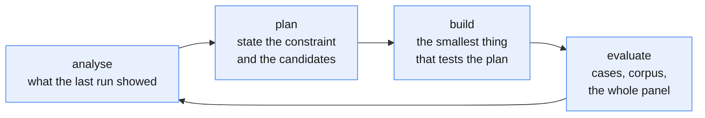

# How this project is worked

Binding for every increment, including small ones. Recorded because the project has already run
the alternative and paid for it: methods were built first, evaluated afterwards, and each "fixed"
was followed by a defect the previous measurement had been unable to see. Three headline numbers
had to be withdrawn that way.

## The loop

**Analyse.** Start from the last evaluation's output, not from intuition about what to do next.
Name what it showed that was not known before. If it showed nothing new, the evaluation was too
weak, and fixing that is the increment.

**Plan.** Write the constraint down in `constraints.md` before writing code: the measurement that
establishes it, what it blocks, the strategy, and at least two candidate methods. One candidate
is not a plan, it is a preference. Say what result would make you abandon the strategy.

**Build.** The smallest thing that lets the plan be tested. A gate goes in as a toggle so it can
be ablated, never as an assertion in a docstring. Negative cases go into `experiments/cases.py`
*before* the method that is supposed to pass them.

**Evaluate.** The panel in `good.md` section 5, not the best cell of it. Compare against at least
one alternative for the same subproblem, because a method with no alternative has been measured,
not evaluated. Then return to analyse: the result is the next cycle's input.

## Rules that fall out of the loop

- **No increment skips evaluation, and no evaluation is a single number.** Report cases, SARI
  components, attestation ceiling, grammaticality and coverage together.
- **A check that cannot fail is not a check.** For every check, state the input that violates it
  and assert that it does. This is not pedantry: the agreement metric returned `True`
  unconditionally for 121 firings and reported 100%.
- **Never adjust a metric because it disagreed with the system under test.** Change it only on an
  independently stated defect, and restate every previously reported number that used it.
- **Ablate, do not assert.** Every licence condition is a claim about what breaks without it.
  Register the variant with the gate off and measure the cost. A gate that costs nothing was not
  doing anything.
- **Report the honest headline.** Coverage and word reduction against the gold, not the metric
  that happens to flatter. The gold cuts 14.5%; say what this cuts.
- **Answer the question asked from data already in hand** before starting new work.

## What "done" means for an increment

1. Its negative cases are in `experiments/cases.py` and pass.
2. It beats the do-nothing baseline on corpus SARI.
3. Its attestation ceiling is reported, with the test shape justified.
4. It does not introduce grammatical defects.
5. It was compared against at least one alternative for the same subproblem.
6. `constraints.md` is updated with what the run revealed, which starts the next cycle.
