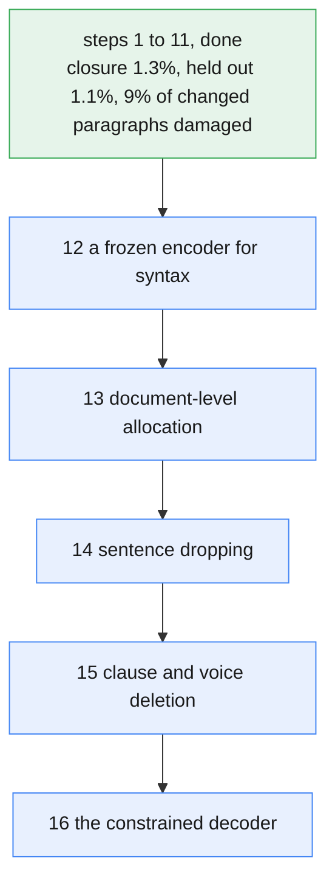

# Plan and roadmap

The one-line objective: **reproduce Opus's copy-editing deterministically, locally, and without a
model.** Everything below is scored against that and nothing else.

The measure is **closure**, defined in `good.md` section 0: the per cent of the word-level
distance from the original text to Opus's edit that the linter has closed. Doing nothing is 0%,
reproducing the gold is 100%, and damage is negative. It is the only number this plan is written
in.

**One roadmap, one numbering.** Section 4 is the whole of it. `constraints.md` records what each
step measured and is an evidence log, not a queue; nothing is scheduled anywhere else.

---

## 1. Where we are

Measured over all 1,490 gold paragraphs (`manage.py evaluate`):

| System | closure | reach | accuracy |
|---|---:|---:|---:|
| do-nothing | 0.0% | 0.0% | n/a |
| **kopi-linter** | **1.3%** | 2.7% | 73.2% |
| served Qwen3-32B | -9.5% | 135.9% | 46.5% |

652 of 52,043 word-edits closed, 1,404 attempted. Held out: **1.1%** against 1.3% on train.

**We are 1.3% of the way to Opus, and that is lower than it was.** Step 9 read 100 changed
paragraphs by hand and found damage in 48 of them, against the five defects the automatic check
reported. The priors that answered it cost 0.4 points of closure and removed four fifths of the
damage, which is the trade `good.md` section 6 point 4 says to take and the first time this
project has had the number on both sides of it. Nine per cent of changed paragraphs now carry an
edit a reader would object to.

**Accuracy is the highest it has been and reach is the lowest since step 6.** Just under three
quarters of edits land on something Opus also changed. Reach is 2.7% because the engine now
refuses far more than it did, and because a written phrase moves fewer words than a deletion.
Nothing in steps 9 to 11 was a reach mechanism; steps 13 and 14 are where reach comes back.

**Qwen is below the break-even line**, changing more than Opus did at under 50% accuracy, so its
output sits further from Opus's version than the untouched original. One honest caveat: closure
measures agreement with Opus, not quality, and a model that paraphrases well in its own voice is
punished for wording the same improvement differently. Quote that row as a reference point, never
as a verdict on Qwen.

## 2. The arithmetic that sets the strategy

Closure decomposes exactly:

    closure = reach x (2 x accuracy - 1)

At 50% accuracy closure is zero however much is attempted, which is the wrecking-ball result
restated as arithmetic. At today's accuracy, **every point of reach is worth about half a point
of closure**. Hold accuracy above roughly 75% and buy reach; below 62% a point of reach is worth
under a quarter of a point, which is where a family stops being worth shipping.

**Watch the marginal accuracy, not the average.** The relative-clause extension came in at 72.3%
on its new work against a 78.1% base. That is still well above break-even, but a family whose
marginal accuracy keeps sliding toward 50% is a family approaching its own ceiling, and the
average will hide that for a long time.

## 3. What each family is worth

Word movement is split by whether the target span is empty, per finding, rather than by
classifying whole families. Closure is denominated in **edit operations**, of which the corpus
holds 52,043; deleting a word costs one, so a family's reach ceiling is its dropped words over
52,043. The linter's own run confirms the conversion, spending 350 operations to remove 347 words.

| Family | dropped | rewritten | reach if fully covered | closure at 76.6% | words per decision |
|---|---:|---:|---:|---:|---:|
| `sentence` | 8,212 | 0 | 15.8% | 8.4 | 18.1 |
| `adjunct` | 5,572 | 729 | 10.7% | 5.7 | 3.3 |
| `clause` | 2,957 | 208 | 5.7% | 3.0 | 4.1 |
| `realisation` | 2,032 | 228 | 3.9% | 2.1 | 1.3 |
| `voice` | 1,863 | 1,125 | 3.6% | 1.9 | 4.1 |
| `phrase` | 1,192 | 5,889 | 2.3% | 1.2 | 2.9 |
| `relative-clause` | 996 | 42 | 1.9% | 1.0 | 5.5 |
| `stance` | 846 | 23 | 1.6% | 0.9 | 1.4 |
| `lexical` | 814 | 41 | 1.6% | 0.8 | 1.1 |
| `modifier` | 572 | 25 | 1.1% | 0.6 | 1.3 |
| **all deletion** | **25,662** | | **49.3%** | **26.2** | |
| **all rewriting** | | **11,571** | **22.2%** | **11.8** | |

Three things follow, and all three set the order below.

**Deletion reaches 49.3 points, not 26.** `clause` at 93% deletion and `voice` at 62% were both
counted as generation families and are mostly Opus cutting. Only `phrase`, `support-verb` and
`nominalisation` genuinely need words written, so writing is deferrable further than it looked.

**Words per decision is the column to build against.** Every decision is a licence risk paid for
in accuracy, so a precision-limited engine should prefer families that move the most words per
risk taken. `sentence` moves 18.1 words per decision against `adjunct`'s 3.3, a 5.5x difference,
and `adjunct` is the family this project has spent most of its cycles on.

**The table cannot sum to 100%.** Deletion and rewriting together account for 71.5% of the
measured edit distance. The remaining 28.5% is reordering and insertion that the evidence layer
does not classify into families at all, and no family-by-family plan reaches it.

## 4. The roadmap

One chain. Each step takes the previous step's result as its input, states the closure it should
buy, and states the result that kills it. A step that misses its number is a finding for
`constraints.md`, not a target to relax.

**1. Build the measurement layer first.** *Done.* Bead alignment, the span taxonomy, the
attestation probe, and closure with its three anchors re-derived on every run. This is why every
step below can fail rather than merely finish.

**2. Scope the repair layer to edit joins.** *Done, C6.* Worth +0.067 SARI and +0.20 delete
precision on its own, purely by making the linter stop editing text no rule had asked to change.
More than any transformation rule has bought since.

**3. Harvest the relative-clause family.** *Done, C13.* Closure 0.2% to 0.3% at 72.3% marginal
accuracy. The three-times-larger lexical-verb extension was refused before it was built, because
Opus declines it 169 times to 1. Attestation now precedes every family.

**4. Make the corpus honest.** *Done, C14.* 1,490 distinct gold slots and not 1,523, dedupe
matching its own docstring, and a document-level split: 20 documents and 1,257 slots to train, 5
documents and 233 slots held out. Nothing learned could be believed before this.

**5. Ask whether a local executor can write, before building one.** *Done, C15.* Hand each gold
span to a backend and score the wording alone. Plain code closes 0.2% of the rewriting gap against
28.8% for deleting the span blind, so hand-written realisation is finished; a closed vocabulary of
970 induced phrases closes 52.6% and reproduces Opus exactly on 64.6% of rewriting spans, holding
on 2,916 held-out spans. That result licensed steps 11 and 16 and killed everything between them.

**6. Fit and wire the keep-or-delete decision.** *Done, C16 and C17.* A logistic regression over
parse and frequency features per source word, three measured shape priors in front of it, and the
rule registered. Closure 0.4% to **1.0%**, held out 0.15% to **0.9%**, at 89.2% attestation, the
highest of any rule here. The ablation refuted the length-in-disguise worry: length alone fires on
zero of 31,464 held-out words, and the lift is lexical first, syntactic second. Ungated the rule
scores higher and introduces eighteen grammatical defects against one, so the priors are the
result and not the overhead.

**7. Trim refused runs instead of dropping them.** *Done, C18, and it missed its target by
fifteen times.* Held out **0.9% to 1.0%**, against the 2% projected, because 839 of the 1,079
refused runs are a single word and have nothing beside the offender to release. The premise was
wrong rather than the build: the projected-to-measured gap is in single-word refusals, so it
belongs to the model wanting words the priors will never allow, not to how the run is arbitrated.
Two priors were added on the way, because trimming around a held-back root deletes the words
holding the root up, and the parser hides both shapes afterwards.

**8. Choose the operating point instead of inheriting it.** *Done, C20, and it was not the
no-op the target predicted.* The `tagged` family had no row in `lint/bands.py`, so it inherited
the default ladder. Each band now takes a row of the model's own operating table: aggressive 0.60
where projected closure peaks, then 0.70, 0.80 and 0.90, at 64.9%, 74.9%, 87.3% and 97.1%
precision. Closure 1.0% to **1.7%**, held out 1.0% to **1.5%**, reach 2.3% to 4.6%, and accuracy
72.1% to 68.1%. Reading the sample output at the new point found a defect that predates the
change, which is where the sixth shape prior came from.

**9. The hand-checked damage set.** *Done, C21, and it was the most expensive result here.* 100
changed held-out paragraphs and 184 edits judged one at a time against G1 to G3, kept in
`damage/verdicts.jsonl` and recomputed by `manage.py damage`. **48 of 100 paragraphs were
damaged** where the automatic check saw five, and agreeing with Opus protected nothing: 50 of the
140 edits both editors appeared to support were damage. Four fifths of it was three structural
shapes, so six priors became five stronger ones, held-out closure fell 1.32% to 0.89%, and the
rate fell to 12%. One half of the step is unanswered: there was one judge, so repeatability is
still a claim.

**10. Make selection safe before a third producer ships.** *Done, C22.* Licensed edits are
scheduled on their own and ranked guesses fill what is left, `_trim` drops the edit that relieves
the breach most cheaply and never one that relieves nothing, and both the requirements and the
parser model are pinned with `install` failing on a mismatch. It met its target exactly: all 233
held-out paragraphs come back byte for byte identical, so the fix is free today and the defect
was real for the day a ranked family registers.

**11. The phrase head.** *Done, C23, and it missed its target by a factor of twenty.* A closed
table of 348 spans, induced from the training documents, writes what Opus wrote on 81.4% of the
held-out spans it fires on, and the rule uses it where the deletion model already licensed the
span. Held-out closure 0.89% to **0.98%**, accuracy 69.5% to 73.9%, and SARI `add` 0.0018 to
0.0074, the first time that column has been anything. The target of 2% to 4% assumed writing
would open new sites; it cannot, because the licence is still the deletion model's, so reach
*fell* from 2.27% to 2.05%. Writing is a precision mechanism here, and the reach is in steps 13
and 14.

**12. A frozen encoder aimed at syntax.** The step 6 ablation says a bag of lemma one-hots
represents the syntactic half worst, and a learned deletion lexicon is the transfer risk that
comes with it. Freeze a small pretrained encoder, mark the span, fit a linear head, score on the
same held-out documents.
Target: beat the one-hot baseline on held-out closure. Fails otherwise, and the lexicon is
recorded as the ceiling of this feature set.

**13. Document-level allocation.** Given a document and a requested reduction, choose which
paragraphs absorb it. The first thing in this project that cannot be decided one paragraph at a
time, and nothing in the code can express it yet.
Target: beat a length-proportional quota. Fails otherwise, and step 14 is unreachable.

**14. Sentence dropping.** The biggest family, pure deletion, 18.1 words per decision. Dropping a
sentence is a discourse decision, which is why it waits for step 13 rather than for a licence.
Target **4% to 8%**.

**15. `clause` and `voice` deletion.** Both reclassified as mostly deletion and neither probed.
Attestation probe first, per step 3.
Target **2% to 4%**, taking the running total to roughly 10% to 17%.

**16. A constrained decoder for `phrase` and `voice` only.** 92.5% of what the vocabulary cannot
reach sits in those two families and `phrase` alone is 84.7%. A small local model, greedy, given a
closed task and never a paragraph, running only where step 11's tagger declined. Last, because
eight rewriting spans in ten are not paraphrase and a model spent on them is a model spent on the
easy part. Unmeasured until an endpoint exists: the decoder backend reports unavailable on this
machine, so the failing half of `manage.py execute --reproduce` has never been exercised.

**Terminal estimate: 30% to 50% closure**, dominated by whether generation accuracy clears 70% and
whether deletion accuracy holds near 80% as coverage grows. Basis: the family table above with
per-step accuracy assumptions stated; estimates only. The residual is the 28.5% of edit distance
no family accounts for, the head-changing paraphrase core, and the fact that Opus is one sample of
a stochastic editor, so 100% is not available to anyone including Opus on a second pass.

## 5. How this plan fails

Stated in advance so it is recognisable when it happens.

- **Accuracy collapses as reach grows.** The likeliest failure, and step 3 already showed the
  shape: marginal 72.3% against an average of 78.1%. If marginal accuracy tracks toward 50% the
  approach caps out near where it is now.
- **Closure and quality come apart.** Closure rewards agreement with one editor, and step 9
  measured how far apart: at 1.32% closure a reader found damage in 48 of 100 changed paragraphs,
  and half of that damage was in edits Opus and Qwen both appeared to support. The damage set is
  the only instrument that sees it, it is hand-made, and it currently has one judge.
- **Family sizes keep overstating opportunity.** Step 3's forecast was wrong by 5x because the
  evidence table names the construction involved, not the transformation applied. The attestation
  probe is the general fix and it has already refused one family.
- **The learned lexicon does not transfer.** 5,924 of the 6,136 fitted columns are lemma one-hots,
  so what step 6 learned is largely a deletion lexicon for this corpus's vocabulary. Untested on
  prose from another field, and step 12 is the answer if it fails.
- **The unclassified 28.5% turns out to be where the work is.** Nothing in this roadmap addresses
  reordering and insertion, and no measurement has yet asked what is in there.

## 6. Standing rules

- `method.md` governs every increment: analyse, plan, build, evaluate, then analyse again.
- **Probe attestation before building a family.** Linguistic validity does not predict it.
- Report closure with reach and accuracy beside it. The composite alone hides which half is broken.
- Never quote SARI as the headline. It is diagnostic, kept for the `add`/`keep`/`delete` split.
- A number that moves for a reason nobody can name is a defect, not a result.
- **Commit a finished step.** This roadmap is the one place in the workspace where committing is
  not the user's job. Once a step is verified and its result is written into section 4, commit it
  with `Re p<step> <tag>`: the step number, the word `part` if only half of it is done, and at
  most three words naming what it covers. For example `Re p3 part 1 classifier`. Nothing else goes
  in the message, and nothing unrelated goes in the commit.
