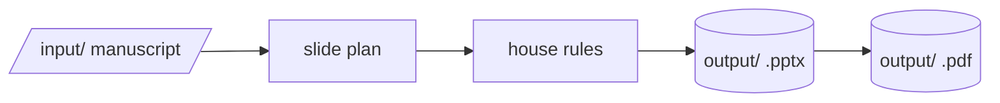

# kopi-presenter 

Turns a manuscript or outline into a styled PowerPoint deck and a PDF in one command. Only the text
sent to the model leaves the machine.

## How it works

A language model distils the text into a slide plan (sections, slides, layouts, evidence). Python
then checks the plan against house rules (quotes only on findings slides, one conclusions slide)
and builds the deck; PowerPoint or LibreOffice exports the PDF.



## Setup

```powershell
pip install -r requirements.txt
Copy-Item config.yaml config.local.yaml
```

Set `api.anthropic_key` in `config.local.yaml`.

## Commands

| Action | Command |
|---|---|
| Build a deck | `python run.py input/paper.docx` |
| Review and revise the plan before building | `python run.py input/paper.docx --review` |
| Rebuild from a saved plan without a model call | `python run.py input/paper.docx --plan output/paper.json` |
