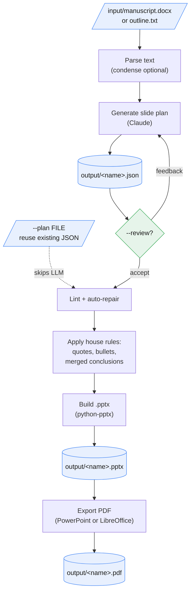

# kopi-presenter

Turning a finished paper into a conference deck is mechanical but slow: pull out the argument, cut it to slide-sized claims, and lay each one out with consistent style. kopi-presenter exists to do that in one command: it turns a manuscript or outline into a presentation-ready PowerPoint deck (`.pptx`) and a PDF. A language model reads the text and distils it into a structured slide plan (sections, slides, layouts, evidence); deterministic Python then checks that plan against a set of house rules and builds a styled `.pptx`, and a PDF is exported alongside it for handout or print. There is no server component: everything runs from a single script against a local file, and only the manuscript text sent to the model leaves the machine.

## Data flow



## Layout

```
run.py             pipeline entrypoint
config.yaml        config template, no secrets
config.local.yaml  local config + API key (gitignored)
requirements.txt
slides/            parser, llm, linter, rules, emitter_pptx, renderer_pptx, icons
input/             manuscripts (.docx) and outlines (.txt) go here
output/            generated .json / .pptx / .pdf land here
```

## Setup

```
pip install -r requirements.txt
cp config.yaml config.local.yaml
```

Set `api.anthropic_key` in `config.local.yaml`, or set the `ANTHROPIC_API_KEY` environment variable, which overrides the file. PDF export needs PowerPoint (the default on Windows) or LibreOffice as an auto-detected fallback; the `.pptx` itself needs neither.

## Commands

kopi-presenter has no interactive menu; every action is a flag on the one pipeline entrypoint, `run.py <input_file>`.

| Action | Command |
|---|---|
| Build a deck (.pptx + PDF) from a manuscript or outline | `run.py input/manuscript.docx` |
| Set the venue string (overrides manuscript + config default) | `run.py input/paper.docx --venue "ICA 2026, Cape Town"` |
| Review the plan before rendering, revise it in plain language | `run.py input/paper.docx --review` |
| Use colour emoji instead of Segoe Fluent icons | `run.py input/paper.docx --emoji` |
| Print the JSON plan only, write no files | `run.py input/paper.docx --dry-run` |
| Rebuild from an existing JSON plan, skip the LLM call | `run.py input/paper.docx --plan output/paper.json` |
| Build the .pptx only, skip PDF export | `run.py input/paper.docx --no-pdf` |
| Trim long paragraphs before sending them to the model | `run.py input/paper.docx --condense` |
| Write output somewhere other than `output/` | `run.py input/paper.docx -o DIR` |

Each field on the deck is derived deterministically after the LLM plan comes back: parsing, linting, house rules, building, and PDF export are all local, so `--dry-run` and `--plan` are the two ways to inspect or reuse a plan without spending another call.

## How it works

- The LLM (`slides/llm.py`) returns a strict JSON plan: sections, slides, layouts, and evidence.
- House rules (`slides/rules.py`) enforce integrity deterministically: quotes appear only on Findings slides, every content slide has bullets, and there is a single merged Conclusions slide.
- The builder (`slides/emitter_pptx.py`) renders the deck with `python-pptx`: breadcrumb navigation, claim titles with an accent rule, bold and coloured key terms, stat callouts, quote and note boxes, two-column cards, matrix and stepflow layouts, a circle motif, and an emoji or icon row.
- The renderer (`slides/renderer_pptx.py`) exports the PDF via PowerPoint for the best fidelity, falling back to LibreOffice when PowerPoint is not available.

By default the full manuscript is sent to the LLM for the richest result; `--condense` trims long paragraphs first to save tokens, at some cost to richness.

With `--review`, the plan is printed after generation and feedback can be entered in plain language; each round of feedback is one further LLM call that revises the plan, repeated until it is accepted or aborted.

## Design system

- Layouts: `bullets`, `split` (bullets plus side evidence), `cards`, `matrix`, `stepflow`, `iconrow`, `boxes`, `circle` (a centre word with orbiting keywords).
- Evidence (side content): `stats` (two or three big numbers), `stat`, `quote-dark` (verbatim, Findings slides only), `note` (synthesised, no quote marks), `figure`.
- Icons: Segoe Fluent Icons (vector, recoloured to the palette) by name, or colour emoji via `--emoji`. Body text auto-sizes to fit; bullets are top-aligned.
- Palette: consistent blue chrome for navigation, title rule, and key terms, plus a categorical set (blue, orange, green, gold, purple, red) for stats, cards, matrix cells, and columns.

> Segoe Fluent Icon glyphs render correctly via the PowerPoint PDF path; the LibreOffice fallback may show them blank. Keep PowerPoint installed for icon fidelity, or use `--emoji`.

## Cost (full 10k-word manuscript, about 13k input tokens)

| Model | Approx. cost per deck | Notes |
|---|---|---|
| Haiku | ~$0.03 | cheapest; good for outlines and clear papers |
| Sonnet | ~$0.10 | balanced; strong argument selection (default) |
| Opus | ~$0.30-0.50 | richest distillation of dense papers |

> Estimates only, verify current Anthropic pricing before relying on them.
